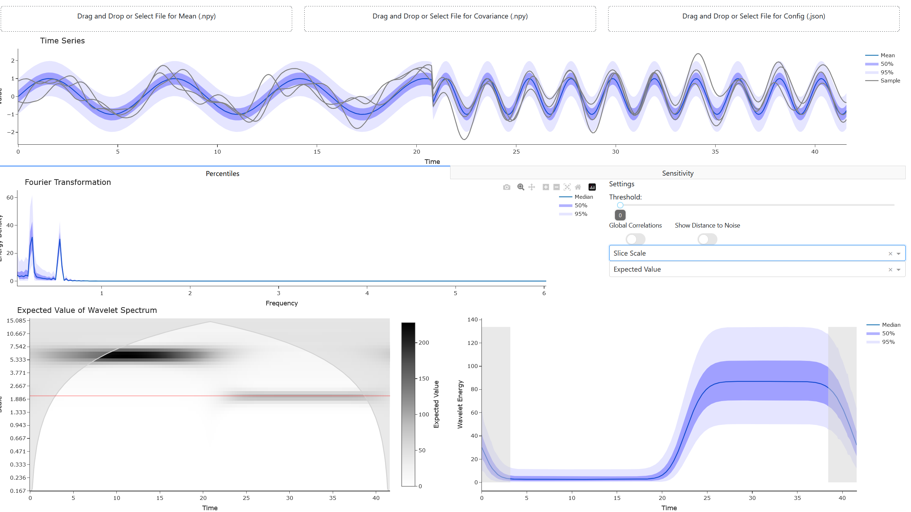

# Uncertainty-aware Spectral Visualization



Spectral analysis is commonly used to investigate time series data and identify features of interest such as dominant frequencies. This approach takes the uncertainty of the input data into account. While the transformations will be included in the library UADAPy (https://github.com/UniStuttgart-VISUS/uadapy), this repository contains the visual analysis tool to support the whole analysis process.

More information can be found in the paper "Uncertainty-aware Spectral Visualization" by Marina Evers and Daniel Weiskopf.

If you use our approach, please cite our paper.
> tba
```
BibTex tba
```

## Installations
The dependencies can be installed by
```
pip install requirements.txt
```
The code was tested on Windows.

## How to Run?
The visual analysis tool requires the mean and the covariance matrix of the time series. These files store numpy arrays. For metadata, it also needs a config file in json format. We included the artificial dataset from the paper for the approach to be ready to use. You can use the config file as a template.
Start the backend using
```
python app.py
```
When shown on the console, open http://127.0.0.1:8050

## How to Use?
### Load the Data
Load the data by selecting the files in the corresponding fields in the top of the application. You can also use drag and drop to load the files.

### Navigating the Visualizations
The visualizations support common navigations strategies such as zooming and panning. The tool bar in the top right provides different options.

### Settings

**Threshold**: Provides the threshold for significant features

**Global Correlations**: Activates showing the global correlations. This computation might take some time because the correlations are currently computed on the fly, we advise to carefully select features of interest before.

**Show Distance to Noise**: Encodes the percentage of data that surpasses a fitted red noise spectrum. Please refer to the paper for more details on the computation.

**First drop down**: Determine what should happen when clicking in the wavelet spectrum. *Correlation* compute the local correlations to the selected point. The next to options show a slice of the wavelet spectrum in the lower right view. *Slice Time* shows a slice for a fixed time step (vertical slice). *Slice Scale* shows a slice for a fixed scale (horizontal slice).

**Second drop down**: Determine which value should be shown in the lower left view for the wavelet spectrum. For using the blink comparator, the user can switch between visualizations using the keys `a` and `d`.

### Sensitivity Analysis
For performing a sensitivity analysis, switch to the tab *Sensitivity*. Here, the user can adapt the perturbation based on the sliders. It is possible to choose between a perturbation in form of a normal distribution and a perturbation following a uniform distribution. The dashed lines encode the perturbation added with respect to the original data.
